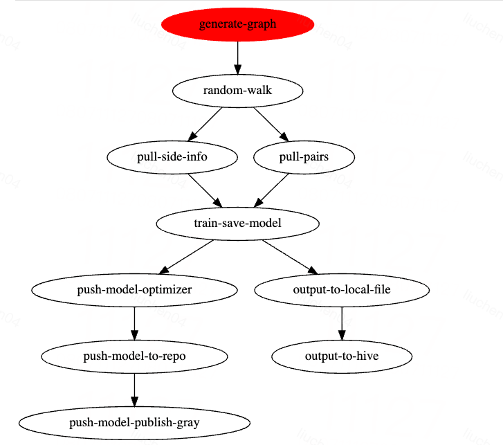

# eges召回流程

## 目的: 利用用户的静态属性构造eges召回模型，解决冷启动问题
## 具体步骤:
1. 收集样本 
   * c_eges_sampler.py
   * pull_side_info_to_arsenal.py
   * pull_pairs_to_arsenal.py
2. 随机游走, 并利用滑动窗口构造正样本
   * 该部分代码未编写，参考https://blog.csdn.net/BIT_666/article/details/130242807
   * eval_pairs.py 评估随机游走的样本是否正常
3. 构造 & 训练 & 保存模型  
   * run_eges.py
   * 训练技巧: 随机mask user_id解决用户冷启动问题
4. 预测 
   * predict_test.py

